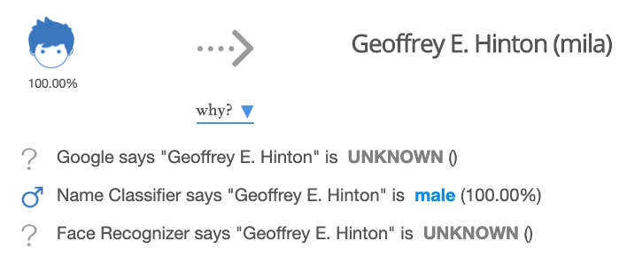

# 性别预测

## 说明

## API URL
```
https://innovaapi.aminer.cn/tools/v1/predict/gender
```

## HTTP Method

```
GET
```

## 输入参数

| 名称             | 说明                      |
| ---------------- | ------------------------- |
| name             | 学者英文名，比如Peter James           |
| org              | 学者机构名，比如Microsoft，可选       |

## 输出结果

```json
{
    "status": 0,
    "message": "success",
    "data": {
        "FGNL": {
            "gender": "UNKNOWN",
            "probability": ""
        },
        "WebGP": {
            "gender": "UNKNOWN",
            "probability": ""
        },
        "Face": {
            "gender": "male",
            "probability": "100.00%"
        },
        "Final": {
            "gender": "male",
            "m_proba": "100.00%",
            "f_proba": "0.00%"
        }
    }
}
```

示例：

